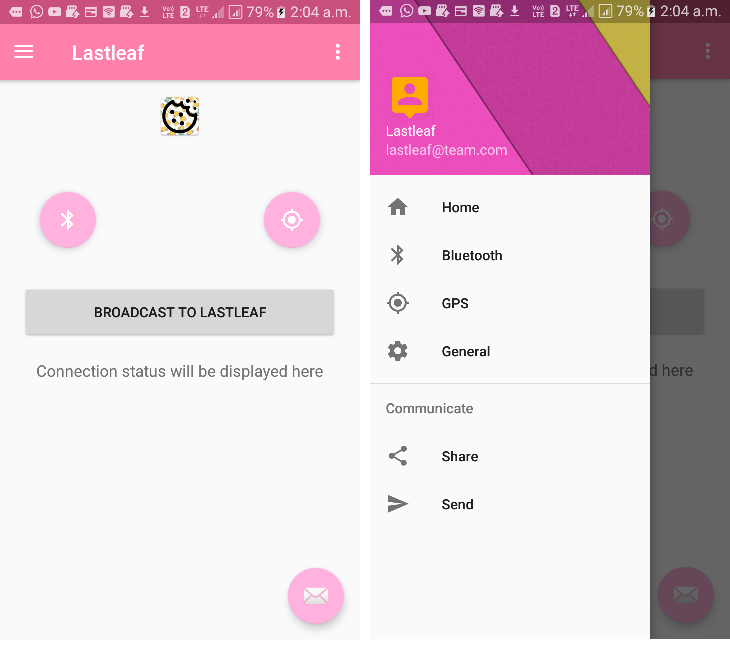

## Lastleaf - Client mobile application

#### About the repository
Lastleaf (moblie client) is a mobile client application that produces `iBeacons` and sends GPS data as payload using the `Bluetooth LE` technology. 

#### Supported devices
Please visit these links to check if your device supports `iBeacons`:
+ https://en.wikipedia.org/wiki/IBeacon#Compatible_devices
+ https://altbeacon.github.io/android-beacon-library/beacon-transmitter-devices.html

#### About the application
Lastleaf (moblie client) is an android application that requests for current GPS location from user and generates beacons to broadcast the `GPS data` (_current latitude and longitude_) as payload. The beacons released maintains `iBeacon` standards. More [here](https://developer.apple.com/ibeacon/Getting-Started-with-iBeacon.pdf). Please note that this application does not involve capturing existing beacons in space. The produced `iBeacon` gets captured by a `Raspberry pi zero W` hardware and triggers events declared in repository [here]().

#### Libraries and dependencies
Please make sure to have the following [library](https://altbeacon.github.io/android-beacon-library/download.html) and dependency before compiling.

```
dependencies {
    implementation 'org.altbeacon:android-beacon-library:2.16.1'
}
```

#### Screenshots


